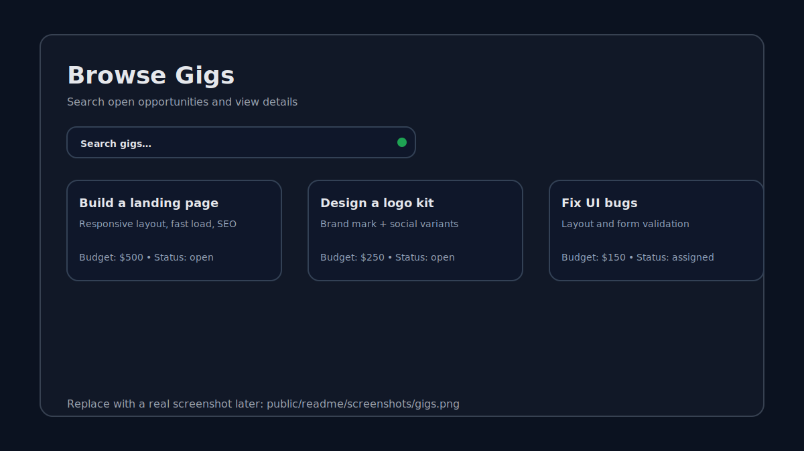
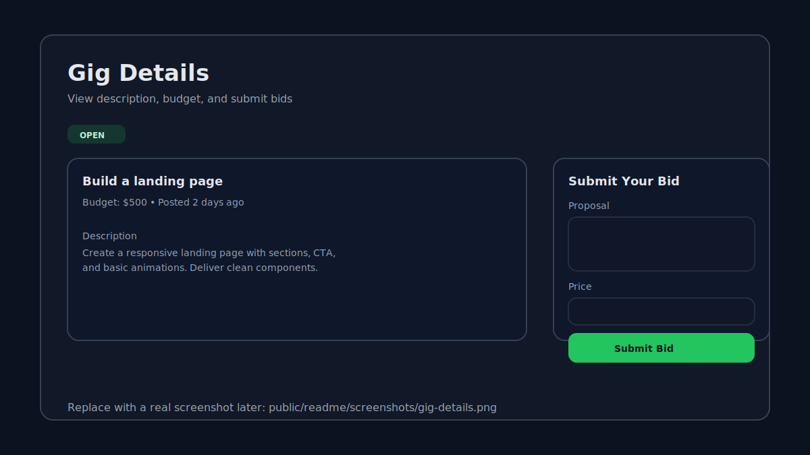
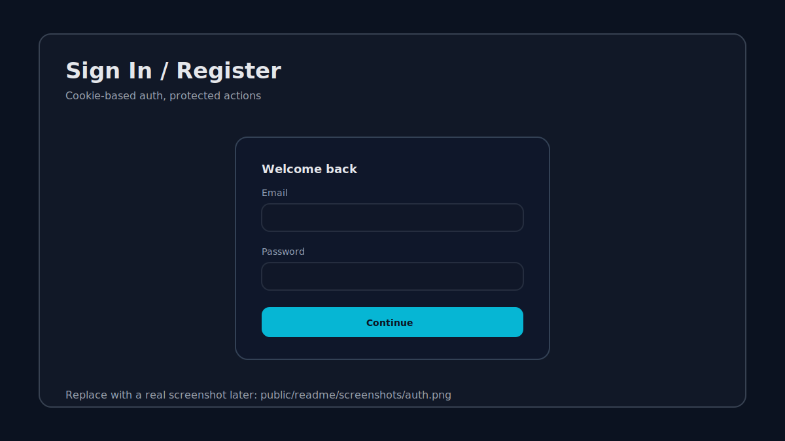
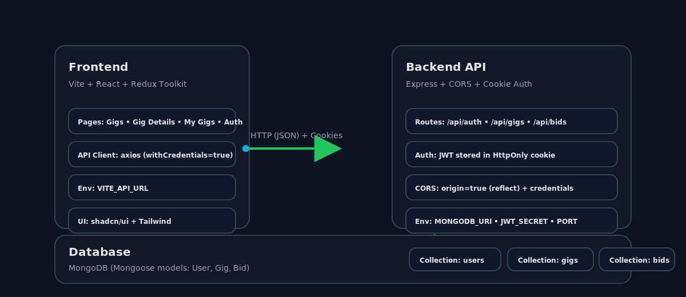

# GigFlow Marketplace


A modern gig marketplace where clients post gigs, freelancers submit bids, and clients hire the best match.

**Frontend:** Vite + React + TypeScript + shadcn/ui + Tailwind  
**Backend:** Express + MongoDB (Mongoose) + Cookie-based JWT auth  
**Status:** Local dev ready

---

## Table of contents

- [Preview](#preview)
- [Features](#features)
- [Tech stack](#tech-stack)
- [Architecture](#architecture)
- [Getting started](#getting-started)
- [Environment variables](#environment-variables)
- [Scripts](#scripts)
- [API overview](#api-overview)
- [Project structure](#project-structure)
- [Notes](#notes)

---

## Preview

> These are lightweight SVG placeholders so the README looks good out-of-the-box.
> Replace them with real screenshots whenever you’re ready.







---

## Features

- **Authentication**: Register, login, logout, and session check (`/auth/me`)
- **Gigs**: Browse, search, view details, and create gigs
- **Bids**: Submit bids to gigs; gig owners can hire a bidder
- **Status flows**:
	- Gigs are **open** or **assigned**
	- Bids are **pending**, **hired**, or **rejected**

---

## Tech stack

**Frontend**

- Vite + React + TypeScript
- Redux Toolkit for state
- axios for API calls
- shadcn/ui + Tailwind CSS for UI

**Backend**

- Express (Node.js)
- MongoDB + Mongoose
- JWT auth stored in an **HttpOnly cookie**
- CORS enabled to accept requests from all origins (dev-friendly)

---

## Architecture



**How it works (high level):**

1. The frontend calls the backend API with `axios`.
2. Auth uses an HttpOnly cookie (`token`) so the browser automatically sends it.
3. The backend persists users/gigs/bids in MongoDB.

---

## Getting started

### Prerequisites

- Node.js (LTS recommended)
- npm
- A MongoDB database (Atlas or local)

### 1) Install frontend deps

```bash
npm install
```

### 2) Install backend deps

```bash
npm install --prefix server
```

### 3) Configure environment

Create your env files (do not commit secrets):

- Frontend: copy [.env.example](.env.example) to `.env.local`
- Backend: copy [server/.env.example](server/.env.example) to `server/.env`

### 4) Run backend

```bash
npm run server:dev
```

Backend runs on `http://localhost:5000` and exposes `http://localhost:5000/api/*`.

### 5) Run frontend

```bash
npm run dev
```

Frontend runs on `http://localhost:8080`.

---

## Environment variables

### Frontend (Vite)

File: `.env.local`

- `VITE_API_URL` (optional)
	- Default: `http://localhost:5000/api`

### Backend (Express)

File: `server/.env`

- `MONGODB_URI` (required)
	- Your MongoDB connection string
- `JWT_SECRET` (required)
	- Any long random string used to sign tokens
- `PORT` (optional)
	- Default: `5000`

---

## Scripts

### Frontend

- `npm run dev` — start Vite dev server
- `npm run build` — production build
- `npm run preview` — preview production build

### Backend

- `npm run server:dev` — start backend with nodemon
- `npm run server:start` — start backend (node)

---

## API overview

Base URL: `http://localhost:5000/api`

### Auth

- `POST /auth/register`
- `POST /auth/login`
- `POST /auth/logout`
- `GET /auth/me`

### Gigs

- `GET /gigs?search=...`
- `GET /gigs/:id`
- `POST /gigs` (requires auth)

### Bids

- `GET /bids/:gigId`
- `POST /bids` (requires auth)
- `PATCH /bids/:bidId/hire` (requires auth; gig owner only)

---

## Project structure

```text
src/
	components/        UI components (gigs, bids, auth, layout)
	lib/api.ts         axios client + API wrappers
	pages/             route-level pages
	store/             Redux store + slices
	types/             shared TypeScript types

server/
	src/
		routes/          Express routes (auth, gigs, bids)
		models/          Mongoose models (User, Gig, Bid)
		middleware/      auth middleware
		index.js         server bootstrap (CORS, cookie parser, routes)
```

---

## Notes

- **CORS is currently open for development.** The server is configured to accept requests from all origins while still supporting cookies.
- If you plan to deploy, tighten CORS (explicit allowlist), set cookies to `secure: true`, and consider `sameSite` based on your domain setup.

